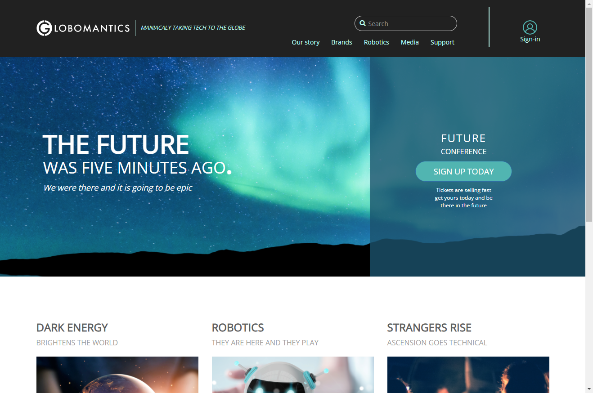

# Cypress-Globo-Tests
This is my first attempt at Cypress testing using a mock website that I reused from a Plural Sight training video. This allowed me a somewhat functional website that could easily be transitioned to Cypress training.
## Motivation
Trying to learn the ins and outs of Cypress Automation Testing and reading articles, blogs and watching videos is just not enough. I definitely need some hands on coding experience. After recently finishing up a Plural Sight lesson I decided to try and add some Cypress tests to the mock website to learn some automation testing.
## Build status
Downloaded zip file from GitHub and followed instructions on the readme page.
## Code style

## Screenshots

## Tech/framework used
(IDE) Used for this project was 'Visual Studio Code'.
## How to use?
1. Open Visual Studio Code and then open folder.
2. Open new terminal and use the **npm start** command. (to launch application)
3. Open browser and go to **localhost:3000**
4. Open additional terminal; navigate to Tests folder and use **npx cypress open** command (to launch cypress)
## Credits
**Special thanks to:**
* [Plural Sight]( https://www.pluralsight.com) – For both the video course on [Cypress: End-to-end JavaScript Testing]( https://www.pluralsight.com/courses/cypress-end-to-end-javascript-testing ), and the Globomantics demo website from the [Working with JavaScript Modules course]( https://www.pluralsight.com/courses/working-javascript-modules).
* [Cypress IO]( https://www.cypress.io/ ) – For providing support, reference material and maintaining the content.
* [Jonathan Mills]( https://www.jeffandjon.com/ ) – Plural Sight Author..
* [Adhithi Ravichandran]( http://adhithiravichandran.com/ ) – Plural Sight Author..
## License
Technically, I really have no dog in this hunt. The [‘Globomantics’]( http://bit.ly/workingwithmodules ) application is currently licensed under the MIT guidelines. I am doing the same, just in case I may have missed anything. 
MIT © [Gilbert Gonzales]()
